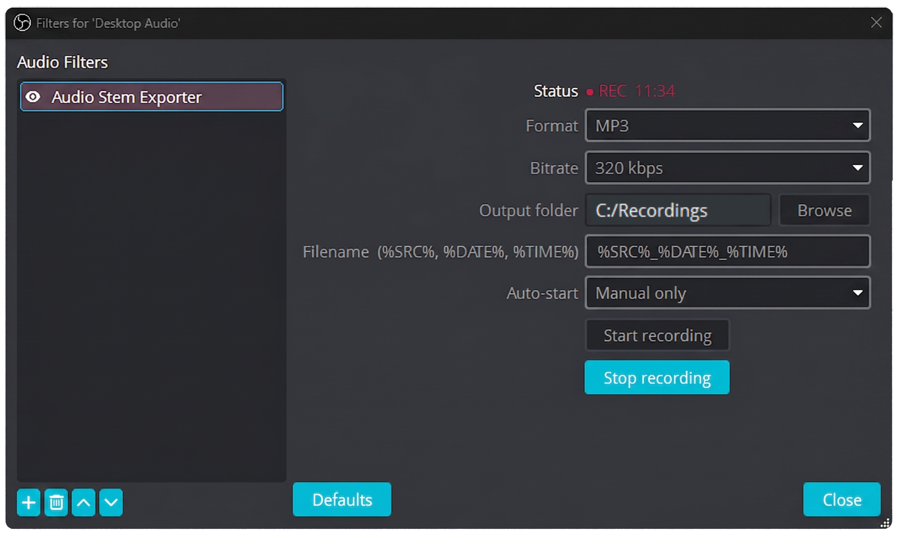
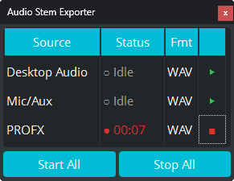

# Audio Stem Exporter

Record any OBS audio source directly to **MP3, WAV, or AIFF** in real time — no conversion needed. Perfect for DJ mixes, stems, and multi-source sessions. **Can't stream and record video at the same time? Capture your audio stems instead — Audio Stem Exporter uses a fraction of the resources.**

> The only OBS plugin that writes MP3 directly. No post-processing, no DAW, no conversion step. Hit record, get an MP3.

> 🎧 **Perfect for DJ laptops** — Running Rekordbox, Serato, or Traktor while streaming on the same machine? There's no headroom left for video recording. Audio Stem Exporter captures your mix as a high-quality MP3 with barely any CPU overhead — so you never lose a set.

> 🎬 **Perfect for content creators** — Recording a stream or podcast? Capture each source as its own stem — mic, game audio, music, chat — so you can edit Reels, Shorts, and highlights with full audio control. No more stuck with a flat mix.

> 🖥️ **Can't stream and record video at the same time?** Audio Stem Exporter uses a fraction of the resources of video recording. No encoding, no heavy processing — if your PC or Mac can run OBS, it can run this. Capture your audio stems while you stream, no matter how old your hardware is.

---

## Screenshots

  

  

---

## Features

- **Direct to MP3** — no conversion, ever
- **WAV and AIFF** also supported
- **Works on any OBS audio source** — mic, browser, media, desktop audio
- **Record multiple sources simultaneously** — each gets its own file
- **Follow Recording mode** — auto-starts and stops with OBS recording
- **Follow Streaming mode** — auto-starts and stops with OBS stream
- **Qt dock panel** — see all sources and control them from one place
- **Free** — no license, no account, no nonsense

---

## Download

| | File |
|---|---|
| **Windows Installer (recommended)** | [AudioStemExporter-Windows-x64-Setup.exe](https://github.com/NoUseForAnger/audio-stem-exporter/releases/latest) |
| **Windows ZIP (manual)** | [AudioStemExporter-Windows-x64.zip](https://github.com/NoUseForAnger/audio-stem-exporter/releases/latest) |
| **macOS PKG (recommended)** | [AudioStemExporter-macOS.pkg](https://github.com/NoUseForAnger/audio-stem-exporter/releases/latest) |
| **macOS ZIP (manual)** | [AudioStemExporter-macOS.zip](https://github.com/NoUseForAnger/audio-stem-exporter/releases/latest) |
| **Linux x86_64** | [AudioStemExporter-Linux-x86_64.zip](https://github.com/NoUseForAnger/audio-stem-exporter/releases/latest) |

**Requires:** OBS Studio 30+

---

## Installation

**Windows Installer:** Run the `.exe` — it auto-detects your OBS folder and installs everything.

**Windows ZIP:**
1. Copy `obs-plugins/64bit/obs-mp3-writer.dll` → your OBS `obs-plugins/64bit/` folder
2. Copy `data/obs-plugins/obs-mp3-writer/locale/en-US.ini` → same path in your OBS `data/` folder
3. Restart OBS

---

## How to Use

### Filter (per source)
1. In OBS, right-click any audio source → **Filters**
2. Click **+** → **Audio Stem Exporter**
3. Choose your output folder and format (MP3, WAV, AIFF)
4. Set your trigger — Manual, Follow Recording, Follow Streaming, or Both
5. Click **Start Recording**

Your file saves automatically when you stop.

### Dock Panel
1. In OBS, go to **Docks** menu → **Audio Stem Exporter**
2. The dock shows all your sources that have the filter applied, their status, and format
3. Click **▶** next to any source to start recording that source individually
4. Click **■** to stop it
5. Use **Start All** / **Stop All** to control everything at once
6. Columns are resizable — drag the column edges to fit your layout

---

## FAQ

**Why is my MP3 file empty?**
Check that the audio source is actually routed and active in OBS — make sure it isn't muted and that the correct device is selected. Also make sure you added the filter to the right source.

**Can I record multiple sources at once?**
Yes — add the filter to each source. Each gets its own file. Use the dock panel to control them all from one place.

**Where does the file get saved?**
Wherever you set the output folder in the filter settings. Default is your Videos folder (Windows) or Movies folder (Mac).

**Does it work while streaming?**
Yes — set the trigger to Follow Streaming and it auto-starts with your stream.

**Is Mac supported?**
Yes — download the macOS PKG or ZIP from the [releases page](https://github.com/NoUseForAnger/audio-stem-exporter/releases/latest).

---

## License

MIT License — Copyright (c) 2026 1134 Digital LLC
See [LICENSE](LICENSE) for details.

---

Built with ❤️ by [Catch22](https://github.com/NoUseForAnger) · [1134.digital](https://1134.digital)
